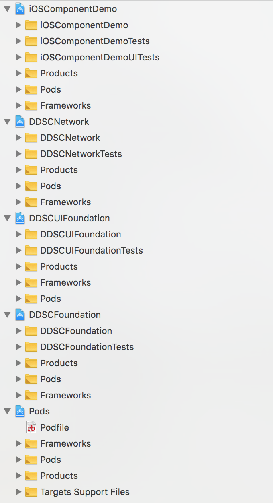

```
# Uncomment the next line to define a global platform for your project
platform :ios, '9.0'
workspace 'DDSCiOSComponent.xcworkspace'

inhibit_all_warnings!

target 'iOSComponentDemo' do
  # Uncomment the next line if you're using Swift or would like to use dynamic frameworks
  # use_frameworks!

  # Pods for iOSComponentDemo
  project 'iOSComponentDemo/iOSComponentDemo.xcodeproj'
  
  pod 'AFNetworking', "~> 3.0"
  
  target 'iOSComponentDemoTests' do
    inherit! :search_paths
    # Pods for testing
  end

  target 'iOSComponentDemoUITests' do
    inherit! :search_paths
    # Pods for testing
  end

end


target 'DDSCFoundation' do
  platform :ios, '9.0'
  project 'DDSCFoundation/DDSCFoundation.xcodeproj'
end


target 'DDSCUIFoundation' do
  platform :ios, '9.0'
  project 'DDSCUIFoundation/DDSCUIFoundation.xcodeproj'
  pod 'Masonry'
end


target 'DDSCNetwork' do
  platform :ios, '9.0'
  project 'DDSCNetwork/DDSCNetwork.xcodeproj'
  
  pod 'AFNetworking', "~> 3.0"
end

```

