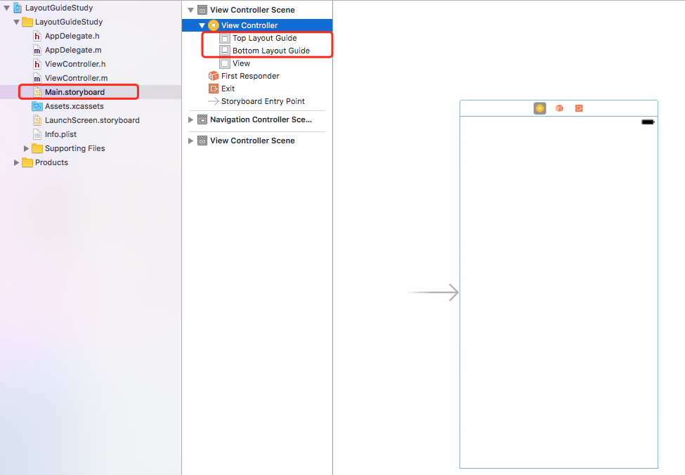
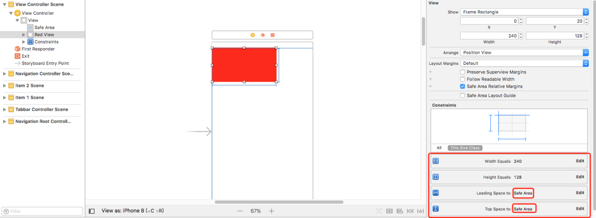

[原文链接](https://www.cnblogs.com/lurenq/p/7849813.html)

## iOS7 topLayoutGuide/bottomLayoutGuide

创建一个叫做LayoutGuideStudy的工程，我们打开看一下Main.storyboard：



可以看到View Controller下面出现`topLayoutGuide/bottomLayoutGuide`这两个东西，并且和Controller的View处于同一层级。并且在UIViewController头文件里面,这两个属性是id类型遵守一个`UILayoutSupport`协议并且是只读的属性：

```objective-c
// These objects may be used as layout items in the NSLayoutConstraint API
@property(nonatomic,readonly,strong) id<UILayoutSupport> topLayoutGuide API_DEPRECATED("Use view.safeAreaLayoutGuide.topAnchor instead of topLayoutGuide.bottomAnchor", ios(7.0,11.0), tvos(7.0,11.0));
@property(nonatomic,readonly,strong) id<UILayoutSupport> bottomLayoutGuide API_DEPRECATED("Use view.safeAreaLayoutGuide.bottomAnchor instead of bottomLayoutGuide.topAnchor", ios(7.0,11.0), tvos(7.0,11.0));
```

这就说明了这两个LayoutGuide是系统自动创建并管理的，这也解释了刚刚我们创建的工程里面**Main.storyboard**为什么会自动出现**topLayoutGuide/bottomLayoutGuide**。

### 看看有什么用

我们拖拽一个红色的view到Controller的view里，添加约束的时候，注意到是右下角的约束设定框，关于顶部约束的基准view下拉选择，xcode默认勾选了Top Layout Guide：


再添加完宽高约束，最后约束结果：


直接Run看结果：


可以看出top约束基于系统提供的`topLayoutGuide`，系统会自动为这个view避开顶部状态栏。
我们在ViewController里面打印红色view：

```objective-c
<UIView: 0x7ff10860fa90; frame = (0 20; 240 128); autoresize = RM+BM; layer = <CALayer: 0x60000003b5c0>>

```

看到红色view的y值就是20.刚好是状态栏的高度。由此看出Top Layout Guide的作用就是在进行自动布局的时候，帮助开发者隔离出状态栏的空间。那么我们再看看导航控制器（顶部出现导航栏）的情况：


Run看结果：


Top Layout Guide同样自动帮助隔离出状态栏+导航栏。
在ViewController里面打印黄色view：

```objective-c
<UIView: 0x7fb04fe08040; frame = (0 64; 240 128); autoresize = RM+BM; layer = <CALayer: 0x61800003ef60>>
```

看到黄色view的y值就是64.刚好是状态栏+导航栏的高度。

同理，bottomLayoutGuide就是用于在TabbarController里面隔离底部的tabbar:


### 扒一扒topLayoutGuide/bottomLayoutGuide对象：

```objective-c
- (void)viewDidLayoutSubviews
 {
    [super viewDidLayoutSubviews];
    NSLog(@"topLayoutGuide-%@",self.topLayoutGuide);
    NSLog(@"bottomLayoutGuide-%@",self.bottomLayoutGuide);
}
```

打印结果：

```objective-c
topLayoutGuide-
<_UILayoutGuide: 0x7fd7cce0c350; frame = (0 0; 0 64); hidden = YES; layer = <CALayer: 0x61000003f2c0>>

bottomLayoutGuide-
<_UILayoutGuide: 0x7fd7cce0d6b0; frame = (0 667; 0 0); hidden = YES; layer = <CALayer: 0x610000221620>>

```

这个是_UILayoutGuide类型的私有对象，看起来里面有frame，hidden，layer属性，感觉十分像UIView啊，那我们就验证一下：

```objective-c
if ([self.topLayoutGuide isKindOfClass:[UIView class]]) {
    NSLog(@"topLayoutGuide is an UIView");
}
 if ([self.bottomLayoutGuide isKindOfClass:[UIView class]]) {
    NSLog(@"bottomLayoutGuide is an UIView");
}
```

打印结果：

```objective-c
topLayoutGuide is an UIView
bottomLayoutGuide is an UIView
```

得到结论就是topLayoutGuide/bottomLayoutGuide其实是一个UIView类型的对象。
我们再打印一下UIViewController的view的subviews：

```objective-c
- (void)viewDidLayoutSubviews
 {
    [super viewDidLayoutSubviews];
     NSLog(@"viewController view subViews %@",self.view.subviews);
}
```

打印结果：

```objective-c
viewController view subViews (
    "<UIView: 0x7ffc774035b0; frame = (0 64; 240 128); autoresize = RM+BM; layer = <CALayer: 0x60800002c720>>",
    "<_UILayoutGuide: 0x7ffc7740ae10; frame = (0 0; 0 64); hidden = YES; layer = <CALayer: 0x60800002c480>>",
    "<_UILayoutGuide: 0x7ffc7740b1e0; frame = (0 667; 0 0); hidden = YES; layer = <CALayer: 0x60800002b820>>"
)
```

**总结一下：**
topLayoutGuide/bottomLayoutGuide其实是**作为虚拟的占坑view，用于在自动布局的时候帮助开发者避开顶部的状态栏，导航栏以及底部的tabbar等**。

## iOS9 UILayoutGuide

iOS9开始，苹果新增加了一个UILayoutGuide的类，看看苹果官方对它的解释：

```
The UILayoutGuide class defines a rectangular area that can interact with Auto Layout. 
Use layout guides to replace the dummy views you may have created to represent
inter-view spaces or encapsulation in your user interface
```

大概意思是UILayoutGuide用于提供一个矩形区域可以用Auto Layout来定制一些约束特性，作为一个虚拟的view使用。
我想大概是苹果的工程师觉得以前的topLayoutGuide/bottomLayoutGuide提供虚拟占坑view，隔离导航栏/tabber的思想不错，进而有了启发，能不能让整个LayoutGuide变得更灵活，让开发者能够自由定制，于是这个UILayoutGuide类就设计出来了。。

那么如何自由定制一个UILayoutGuide，我们看看这个类的几个属性：

```objective-c
@property(nonatomic,readonly,strong) NSLayoutXAxisAnchor *leadingAnchor;
@property(nonatomic,readonly,strong) NSLayoutXAxisAnchor *trailingAnchor;
@property(nonatomic,readonly,strong) NSLayoutXAxisAnchor *leftAnchor;
@property(nonatomic,readonly,strong) NSLayoutXAxisAnchor *rightAnchor;
@property(nonatomic,readonly,strong) NSLayoutYAxisAnchor *topAnchor;
@property(nonatomic,readonly,strong) NSLayoutYAxisAnchor *bottomAnchor;
@property(nonatomic,readonly,strong) NSLayoutDimension *widthAnchor;
@property(nonatomic,readonly,strong) NSLayoutDimension *heightAnchor;
@property(nonatomic,readonly,strong) NSLayoutXAxisAnchor *centerXAnchor;
@property(nonatomic,readonly,strong) NSLayoutYAxisAnchor *centerYAnchor;
```

NSLayoutXAxisAnchor,NSLayoutYAxisAnchor,NSLayoutDimension这几个类也是跟随UILayoutGuide在
iOS9以后新增的，即便很陌生，但我们看上面UILayoutGuide的几个属性里面leading，trailing，top，bottom，center等熟悉的字眼，就能明白这些属性就是用于给UILayoutGuide对象增加布局约束的。

我们在看UIView里面新增的一个分类：

```objective-c
@interface UIView (UIViewLayoutConstraintCreation)

@property(readonly, strong) NSLayoutXAxisAnchor *leadingAnchor NS_AVAILABLE_IOS(9_0);
@property(readonly, strong) NSLayoutXAxisAnchor *trailingAnchor NS_AVAILABLE_IOS(9_0);
@property(readonly, strong) NSLayoutXAxisAnchor *leftAnchor NS_AVAILABLE_IOS(9_0);
@property(readonly, strong) NSLayoutXAxisAnchor *rightAnchor NS_AVAILABLE_IOS(9_0);
@property(readonly, strong) NSLayoutYAxisAnchor *topAnchor NS_AVAILABLE_IOS(9_0);
@property(readonly, strong) NSLayoutYAxisAnchor *bottomAnchor NS_AVAILABLE_IOS(9_0);
@property(readonly, strong) NSLayoutDimension *widthAnchor NS_AVAILABLE_IOS(9_0);
@property(readonly, strong) NSLayoutDimension *heightAnchor NS_AVAILABLE_IOS(9_0);
@property(readonly, strong) NSLayoutXAxisAnchor *centerXAnchor NS_AVAILABLE_IOS(9_0);
@property(readonly, strong) NSLayoutYAxisAnchor *centerYAnchor NS_AVAILABLE_IOS(9_0);
@property(readonly, strong) NSLayoutYAxisAnchor *firstBaselineAnchor NS_AVAILABLE_IOS(9_0);
@property(readonly, strong) NSLayoutYAxisAnchor *lastBaselineAnchor NS_AVAILABLE_IOS(9_0);

@end
```

也是跟UILayoutGuide一样的提供了一致的属性。这就说明了UILayoutGuide是可以跟UIView进行Auto Layout的约束交互的。

### 我们用一个例子说明：

创建一个UILayoutGuide，约束它**距离控制器view的顶部64，左边0，宽250，高200**，于是在viewDidLoad方法里面的代码：

```objective-c
// 创建
UILayoutGuide *layoutGuide = [[UILayoutGuide alloc] init];
// 需要使用UIView的addLayoutGuide方法添加新建的layoutGuide
[self.view addLayoutGuide:layoutGuide];
// 正式的约束代码
[layoutGuide.topAnchor constraintEqualToAnchor:self.view.topAnchor constant:64].active = YES;
[layoutGuide.leadingAnchor constraintEqualToAnchor:self.view.leadingAnchor].active = YES;
[layoutGuide.widthAnchor constraintEqualToConstant:250].active = YES;
[layoutGuide.heightAnchor constraintEqualToConstant:200].active = YES;
```

这样约束代码明显比使用NSLayoutConstraint简洁多了。

接着，我们再创建一个紫色view，基于这个创建的layoutGuide进行约束，**紫色view顶部距离上述layoutGuide底部20，和layoutGuide左对齐，宽和高和layoutGuide保持一致**：

```objective-c
UIView *viewBaseLayoutGuide = [[UIView alloc] init];
viewBaseLayoutGuide.translatesAutoresizingMaskIntoConstraints = NO;
viewBaseLayoutGuide.backgroundColor = [UIColor purpleColor];
[self.view addSubview:viewBaseLayoutGuide];

[viewBaseLayoutGuide.topAnchor constraintEqualToAnchor:layoutGuide.bottomAnchor constant:20].active = YES;
[viewBaseLayoutGuide.leadingAnchor constraintEqualToAnchor:layoutGuide.leadingAnchor].active = YES;
[viewBaseLayoutGuide.widthAnchor constraintEqualToAnchor:layoutGuide.widthAnchor].active = YES;
[viewBaseLayoutGuide.heightAnchor constraintEqualToAnchor:layoutGuide.heightAnchor].active = YES;
```

运行程序的结果：


## iOS11 Safe Area / safeAreaLayoutGuide

iOS11又引入了一个Safe Area（安全区域）的概念，苹果建议在这个安全区域内放置UI控件。这个安全区域的范围其实就是整个屏幕**隔离出状态栏，导航栏，tabar，以及iPhone X顶部刘海，底部虚拟home手势区域的**范围。
从这个介绍可以看得出，所谓的Safe Area其实也就是**升级版本的topLayoutGuide/bottomLayoutGuide**，以前只能限制top/bottom的Layout，现在更加强大了。
再看一下UIViewController头文件：（用xcode9以上版本打开）：

```objective-c
@property(nonatomic,readonly,strong) id<UILayoutSupport> topLayoutGuide API_DEPRECATED_WITH_REPLACEMENT("-[UIView safeAreaLayoutGuide]", ios(7.0,11.0), tvos(7.0,11.0));
@property(nonatomic,readonly,strong) id<UILayoutSupport> bottomLayoutGuide API_DEPRECATED_WITH_REPLACEMENT("-[UIView safeAreaLayoutGuide]", ios(7.0,11.0), tvos(7.0,11.0));
```

苹果提示**topLayoutGuide/bottomLayoutGuide**这两个属性在**iOS11已经过期，推荐使用UIView 的safeAreaLayoutGuide属性**（safeAreaLayoutGuide稍后会介绍）。

另外用xcode9以上版本创建工程的时候，Main.storyboard会默认选择Use Safe Area Layout Guides，控制器view下面会出现safe area：


#### 验证使用safeArea的效果：

如上图所示，我们基于storyboard提供的控制器view的safeArea区域对红色的view进行约束：顶部距离
安全区域0，左边距离安全区域0，宽240，高180：



**在iPhone 8上运行结果：**


为了验证Safe Area在竖屏iPhone X底部起到的隔离作用，又增加了一个棕色的view：左边距离安全区域0，底部距离安全区域0，宽240，高180：


**在iPhone X上运行结果：**


利用安全区域进行Auto Layout布局，分别在iPhone 8，iPhone X上以及避开了状态栏/刘海/底部的home虚拟手势区域，使得开发者不用关心状态栏以及适配iPhone X避开刘海的高度，只需要安安心心的苹果指定的这个安全区域放置子控件，布局就可以了。

#### UIView 的safeAreaLayoutGuide属性

查看UIView在iOS11上关于Safe Area新增的两个属性：

```objective-c
@property (nonatomic,readonly) UIEdgeInsets safeAreaInsets API_AVAILABLE(ios(11.0),tvos(11.0));
@property(nonatomic,readonly,strong) UILayoutGuide *safeAreaLayoutGuide API_AVAILABLE(ios(11.0),tvos(11.0));
```

很明显这个只读的safeAreaLayoutGuide属性是系统自动创建的，可以让开发者用代码进行基于安全区域进行自动布局。
点击控制器的view触发touchesBegan进行打印验证：

```objective-c
- (void)touchesBegan:(NSSet<UITouch *> *)touches withEvent:(UIEvent *)event
{
    NSLog(@"safeAreaInsets %@",NSStringFromUIEdgeInsets(self.view.safeAreaInsets));
    NSLog(@"safeAreaGuide %@",self.view.safeAreaLayoutGuide);
}
打印结果：
safeAreaInsets {44, 0, 34, 0}
safeAreaGuide <UILayoutGuide: 0x6080009a3c60 - "UIViewSafeAreaLayoutGuide",
layoutFrame = {{0, 44}, {375, 734}}, owningView = <UIView: 0x7f888240c3b0; frame = (0 0; 375 812); 
autoresize = W+H; layer = <CALayer: 0x608000431ec0>>>
```

根据打印结果safeAreaInsets.top=44，刚好是苹果规定的适配iPhone X要避开的刘海的距离，
safeAreaInsets.bottom=34，刚好是底部的home虚拟手势区域的高度。

### 横屏旋转测试：

进行横屏切换后：


再次点击控制器的view触发touchesBegan进行打印验证，打印结果：

```
safeAreaInsets {0, 44, 21, 44}
safeAreaGuide <UILayoutGuide: 0x6080009a3c60 - "UIViewSafeAreaLayoutGuide", layoutFrame =
{{44, 0}, {724, 354}}, owningView = <UIView: 0x7f888240c3b0; frame = (0 0; 812 375); autoresize =
W+H; layer = <CALayer: 0x608000431ec0>>>
```

旋转之后，safeAreaInsets.left距离刘海隔离区域依然是44，底部的home虚拟手势区域变成了21。
由此证明，**系统也把屏幕旋转的情况也自动计算好了。**


**iOS 11.0之后系统新增安全区域变化方法**

UIViewController中新增：`- (void)viewSafeAreaInsetsDidChange;`

UIView中新增：`- (void)safeAreaInsetsDidChange;`

**通过安全区域变化来改变视图的位置**

如果屏幕旋转，相应的安全区域也会变化，所以不比担心。

```objective-c
`images.jianshu.io/upload_images/``1186277``-ab32b1be56378531.gif?imageMogr2/auto-orient/strip%7CimageView2/``2``/w/``1240``)``- (``void``)viewSafeAreaInsetsDidChange {``    ``[``super` `viewSafeAreaInsetsDidChange];``    ` `    ``NSLog(@``"viewSafeAreaInsetsDidChange-%@"``,NSStringFromUIEdgeInsets(self.view.safeAreaInsets));``    ` `    ``[self updateOrientation];``}`
```


## 总结

这次为了适配iPhone X，个人从一开始看到iOS11的Safe Area这个概念，追溯到iOS7 topLayoutGuide/bottomLayoutGuide，从头开始学习，受益匪浅。也体会到了苹果工程师针对UI适配，面向开发者进行的一系列探索，以及优化的心路历程。也看到了他们如何将一个好的思路，面对当前的需求变化，进行合理的扩展，设计出的灵活可扩展的API：
**1.iOS7: topLayoutGuide/bottomLayoutGuide，利用一个虚拟的view初步解决导航栏，tabbar的隔离问题。**

**2.iOS9:有了虚拟view的思路,又考虑能不能去除top/bottom概念的局限性，让开发者都可以灵活自定义这个隔离区域，又提供一些更方便简洁易懂的API方便进行代码自动布局，于是有了UILayoutGuide这个类。。**

**3.两年后的iOS11,有了iPhone X，苹果工程师顺理成章的将他们在iOS9的探索成果利用起来，他们自定义了一个UILayoutGuide，给开发者提供了一个只读属性的safeAreaLayoutGuide，并且提出安全区域的概念。**