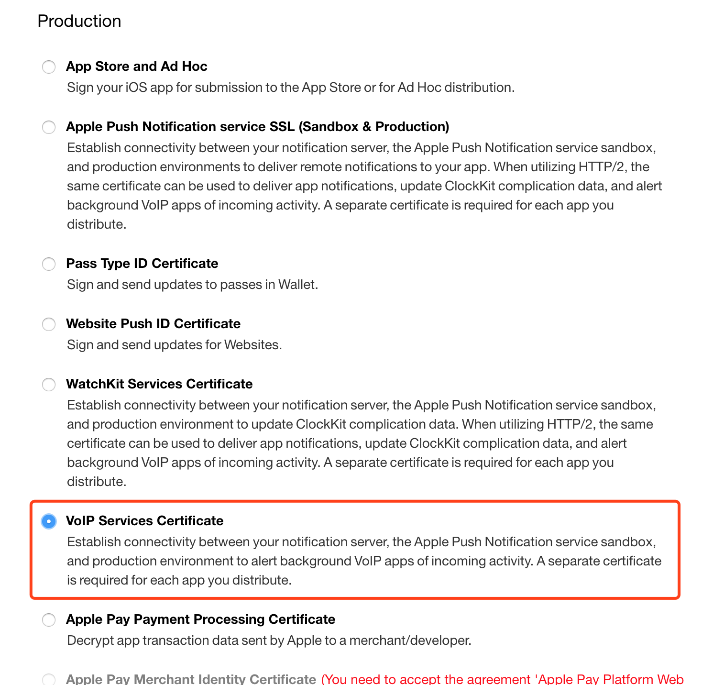
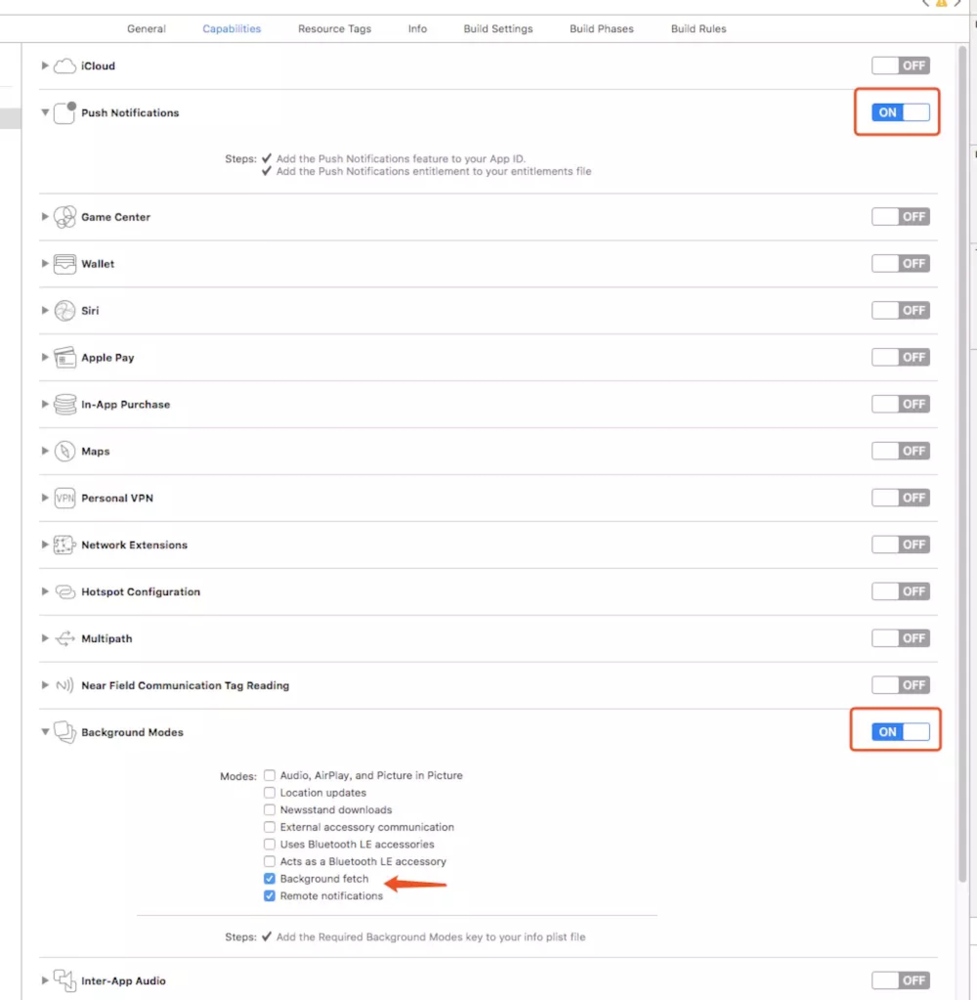
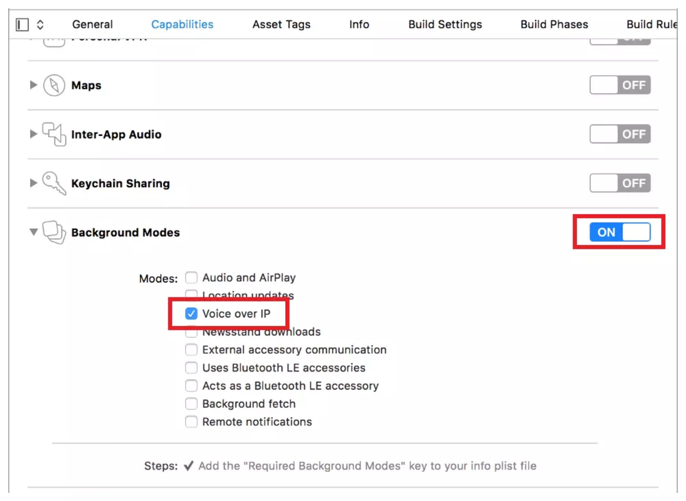

## VOIP使用PushKit

PushKit是苹果在iOS8之后推出的新框架，iOS10之后，苹果更是禁止VOIP应用在后台使用socket长链接，PushKit可以说是为了VOIP而生，满足实时性的同时，还能达到省电的效果，搭配苹果自己的CallKit，可以呈现出类似原生电话通话的效果。
 PushKit区别与普通APNs的地方是，它不会弹出通知，而是直接唤醒你的APP，进入回调，也就是说，可以在没点击APP启动的情况下，就运行我们自己写的代码，当然，推送证书和注册、回调的方法也和APNs不同，具体操作如下

### 1.创建推送证书

### 

### 2.项目配置




需要注意的是，XCode9在Background Modes的设置里没有VoIP的选项，需要在info.plist里面手动添加**App provides Voice over IP services**


XCode8会有VoIP选项需要打开



### 3.代码配置

```objective-c
#import <PushKit/PushKit.h>
```

在AppDelege didFinishLaunchingWithOptions方法添加以下代码

```objective-c
PKPushRegistry *pushRegistry = [[PKPushRegistry alloc] initWithQueue:dispatch_get_main_queue()];
pushRegistry.delegate = self;
pushRegistry.desiredPushTypes = [NSSet setWithObject:PKPushTypeVoIP];
```

实现PKPushRegistryDelegate的回调方法

```objective-c
#pragma mark - PKPushRegistryDelegate

- (void)pushRegistry:(PKPushRegistry *)registry didUpdatePushCredentials:(PKPushCredentials *)pushCredentials forType:(PKPushType)type {
    // Register VoIP push token (a property of PKPushCredentials) with server
    NSString *voiptoken = [pushCredentials.token.description stringByTrimmingCharactersInSet:[NSCharacterSet characterSetWithCharactersInString:@"<>"]];
    voiptoken = [voiptoken stringByReplacingOccurrencesOfString:@" " withString:@""];
}

- (void)pushRegistry:(PKPushRegistry *)registry didReceiveIncomingPushWithPayload:(PKPushPayload *)payload forType:(PKPushType)type {
    
}
```

